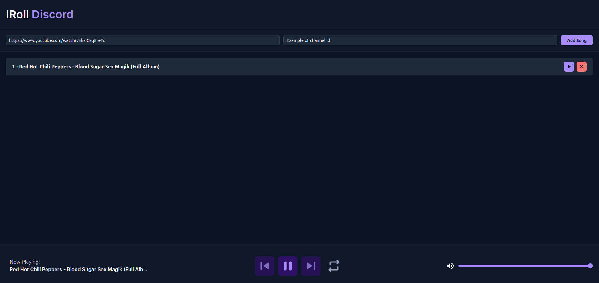

# 🎲 IRoll Discord



> This is a project focused on providing a better experience when playing RPG using Discord, for while, this project only has music features for the DM, but more features will come.

Currently, the project provides an interface that lets the DM control all the game music just by clicking buttons, instead of typing commands every time to do simple tasks, making it easier to improve the immersion in the game.


## Tech Stack


## ⚙️ Features

- Pause and unpause songs
- Add musics via URL
- Manage playlist
- Control song volume
- Control song or queue loop
- Skip songs


## 💻 Prerequisites

To run this project, you must have the following prerequisites:
- Node on version 18 or later
- A discord bot on the [Discord Developer Portal](https://discord.com/developers/docs/intro)
- Basic knowledge on Discord bot development
## 🚀 Run Locally

Clone the project

```
  git clone git@github.com:Catskhi/IRoll_Discord.git
```

Go to the project directory

```
  cd IRoll_Discord
```

Open a terminal on the frontend and other on server
```
  cd frontend
  cd server
```

On both folders, install the dependencies
```
  npm install
```

Before starting the project, you will need to set the following environment variables to your .env file:

- The token of your discord bot

    `DISCORD TOKEN`

- Your discord client ID

    `DISCORD_CLIENT_ID`

Build and start

```
  npm run build
  npm run start
```

🐋 You can run the project using docker, just run the command below

```
  docker compose up
```


## Roadmap

- Add tests
- Improve streaming performance
- Add more RPG related features


## Authors

<table>
  <tr>
    <td align="center">
      <a href="#" title="defina o titulo do link">
        <br>
        <sub>
          <b>Catskhi</b>
        </sub>
      </a>
    </td>
  </tr>
</table>


## Environment Variables

To run this project, you will need to add the following environment variables to your .env file

`API_KEY`

`ANOTHER_API_KEY`

